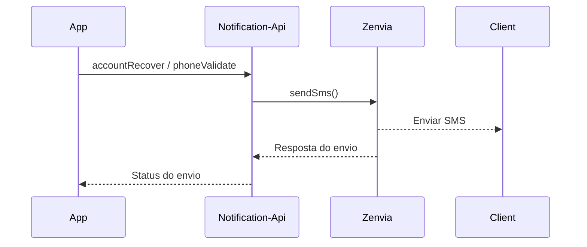

# Notification-api
Aplicação que disponibiliza recursos para envio de notificações via celular e/ou e-mail.


* O objetivo é fornecer uma api para envio de notificações específicas, tais como: *token para validações de telefone/e-mail, autenticação de dois fatores no acesso à conta, etc*.

</br>



</br>

### Recursos e tecnologias
Descrição dos principais itens contidos no desenvolvimento da aplicação:

* Docker
* MySQL
* Flyway
* Java
* Gradle
* Spring Boot
* [Zenvia](https://www.zenvia.com/) (api externa de comunicação)

</br>

### Executar
Sequência de passos para executar a aplicação: </br>
- **Requisitos:** *Docker e Docker Compose*

```bash
# Clonar repositório
$ git clone https://github.com/leodoima/notification-api.git

# Ir para pasta raiz do projeto
$ cd notification-api

# Configurar variáveis de ambiente no arquivo
$ src/main/resources/application.properties

# Rodar docker
$ docker compose up --build
```

</br>

### Melhorias futuras
Ideias de como evoluir esta aplicação:

- [ ] Implementar recurso de Health Check
- [ ] Aplicar envio de e-mail
- [ ] Implementar recurso para documentação da API
- [ ] Aplicar testes unitários
- [ ] Implementar uso de filas para controle de requisições
